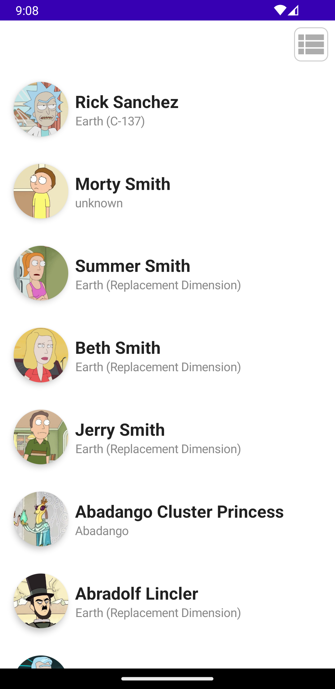
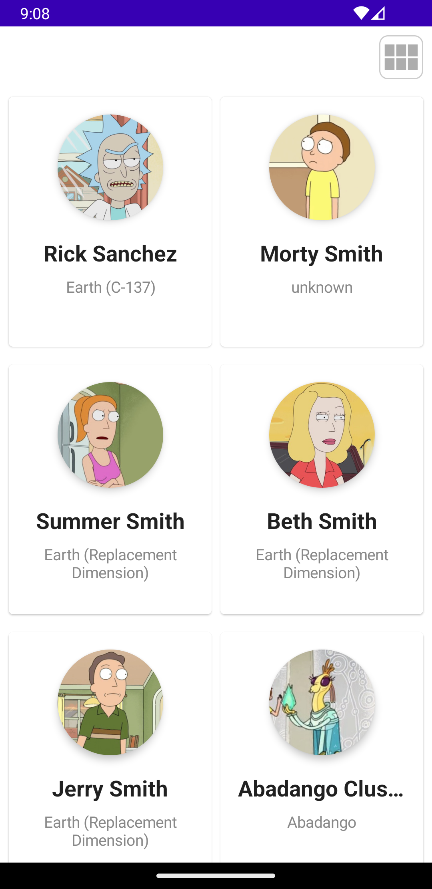
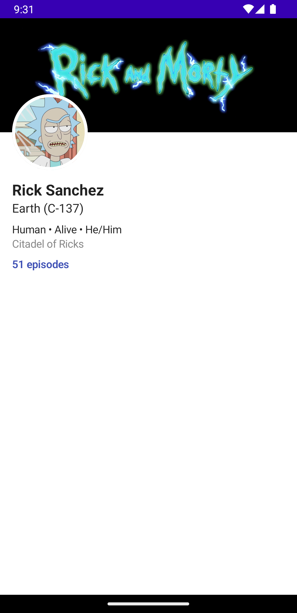

# RMDb

 Simple app presenting information about Rick & Morty characters, showcasing clean architecture and some of the newest android technologies 

<h2>Main Screen</h2>

  
  

<h2>Character Screen</h2>

  

<h2>Tech Stack</h2>
<h3> UI </h3>
<ul> 
    <li> Jetpack Compose </li>
    <li> Compose Destinations </li>
    <li> Coil </li>
</ul> 

<h3> Data </h3>
<ul> 
    <li> Retrofit </li>
    <li> Room </li>
    <li> Paging3 </li>
</ul>

<h3> DI </h3>
<ul> 
    <li> Hilt </li>
</ul>

<h3> Clean Architecture </h3>
<ul> 
    <li> Coroutines & Flows </li>
</ul>

<h2>License</h2>

    This project is licensed under the terms of the 
        <a href="/Yairgadiel/RMDb/blob/master/LICENSE">MIT License</a>

